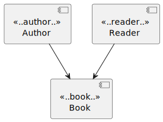

# ArchUnit

***
* [About](#about)
* [Defining what is analyzed](#defining-what-is-analyzed)
* [Areas](#areas)
    + [Core](#core)
    + [Lang](#lang)
    + [Library](#library)
        - [Layer checks](#layer-checks)
        - [Onion architecture](#onion-architecture)
        - [Slicing](#slicing)
* [Customization](#customization)
    + [Custom rules](#custom-rules)
    + [Custom concepts](#custom-concepts)
    + [Display format](#display-format)
* [Predefined predicates and conditions](#predefined-predicates-and-conditions)
* [PlantUML](#plantuml)
* [Architecture metrics](#architecture-metrics)
* [Resolution behaviour](#resolution-behaviour)
* [Adding ArchUnit to an existing application](#adding-archunit-to-an-existing-application)
* [Notes](#notes)
* [References](#references)
***

## About

[ArchUnit](https://www.archunit.org/) is a library that allows us to test our architecture (layering/slicing/(naming) conventions, ...)

Why does this matter? It's all about leaving a legacy and safeguarding it. During the lifecycle of a project, people might shift roles, join the team, ... And might not be aware of the conventions within the team/organization. 

Testing your architecture is both an aid to ascertain that the architecture is being implemented consistently and also makes it easier for people onboarding to get a grasp of what that agreed architecture is.

One of the advantages of ArchUnit is also that it is "just" another test, and does not need any special infrastructure/new language/... it's just plain old Java (or Kotlin) that can be evaluated with a unit testing tool like JUnit.

Please feel free to clone this repository, so you can easily follow along.

***

## Defining what is analyzed

There are a couple of ways to determine what should be analyzed:
* based upon the class(es)
* by package(s)
* a custom location provider
* using the ClassFileImporter directly on packages/path

Examples can be found in the `analysismanagement` package

***

## Areas

### Core

This contains well, the Core API of ArchUnit which offers us ways to access fields, methods, classes, ... (`JavaMethod, JavaField, getMethods(), getRawParametersTypes(), ...`) 

And we can import these using certain provided APIs (see for reference `dev.simonverhoeven.archunitdemo.analysismanagement\ClassFileImporterTest.java` for some samples albeit there certainly are a lot more options)

As seen you can also add `ImportOptions` to further narrow what's imported. There are also certain predefined ones such as `ImportOption.Predefined.DO_NOT_INCLUDE_JARS`.

A sample of a rule to verify that classes under service do not access anything in the controller package:

````Java
final var importedClasses = new ClassFileImporter().importPackages("dev.simonverhoeven.archunitdemo.layerviolationmodule");
final var services = importedClasses.stream()
        .filter(clazz -> clazz.isAnnotatedWith(Service.class) || clazz.getName().contains(".service."))
        .collect(Collectors.toSet());

services.forEach(service -> {
    service.getAccessesFromSelf().forEach(access -> {
        final var targetName = access.getTargetOwner().getName();

        if (targetName.contains(".controller.")) {
            final var message = String.format("Service %s accesses Controller %s in line %d",
                    service.getName(), targetName, access.getLineNumber());
            fail(message);
        }
    });
});
````

As you can see this is a tad cumbersome, and this is where the higher-level Lang API comes into play

### Lang

The lang API offers us some nice functionalities to be more expressive about our architectural concepts.

We can rewrite the Core sample to something pretty similar using:

````Java
final var importedClasses = new ClassFileImporter().importPackages("dev.simonverhoeven.archunitdemo.layerviolationmodule");
final var rule = ArchRuleDefinition.noClasses()
        .that().resideInAPackage("..service..")
        .should().accessClassesThat().resideInAPackage("..controller..");

rule.check(importedClasses);
````

### Library

The library API offers us some nice convenience functions to easily check some common, but complex patterns

* layered architecture
* onion architecture
* slicing
* General coding roles (literally General such as no usage of Joda time, dependency rules, proxy rules)
* using PLANTUML component diagram as rules

#### Layer checks

Thanks to `LayeredArchitecture` we can easily define our layers, and verify the way they are accessed. 

````Java
final var architectureRule = layeredArchitecture()
        .consideringAllDependencies()
        .layer("Controller").definedBy("..controller..")
        .layer("Service").definedBy("..service..")
        .layer("Persistence").definedBy("..persistence..")
        .whereLayer("Controller").mayNotBeAccessedByAnyLayer()
        .whereLayer("Service").mayOnlyBeAccessedByLayers("Controller")
        .whereLayer("Persistence").mayOnlyBeAccessedByLayers("Service");

final var importedClasses = new ClassFileImporter().importPackages("dev.simonverhoeven.archunitdemo.layeredmodule");
        architectureRule.check(importedClasses);
````

An example can be found [here](src\test\java\dev\simonverhoeven\archunitdemo\LayerTest.java)

***

#### Onion architecture

Using `OnionArchitecture` we define our domain, application services, and adapter and verify whether our classes adhere to these (with optionally some exclusions).

````Java
@Test
void onion() {
    final var rule = onionArchitecture()
        .domainModels("..domain.model..")
        .domainServices("..domain.service..")
        .applicationServices("..application..")
        .adapter("persistence", "..adapter.persistence..")
        .adapter("rest", "..adapter.rest..")
        .ensureAllClassesAreContainedInArchitecture();

    final var importedClasses = new ClassFileImporter().importPackages("dev.simonverhoeven.archunitdemo.onionmodule");
    rule.check(importedClasses);
}
````

An example can be found [here](src\test\java\dev\simonverhoeven\archunitdemo\OnionTest.java) which uses the slicingmodule as a verification source. The onion package contains a setup with some violations to demonstrate the validation


#### Slicing

Using `SlicesRuleDefinition` we can verify whether our slices are free of cycles/dependencies on each other.

An example can be found [here](src\test\java\dev\simonverhoeven\archunitdemo\SliceTest.java) which uses the slicingmodule as a verification source.

***

## Customization

### Custom rules

We can also define our own rules that adhere to the general architectural rule of `classes that {PREDICATE} should {CONDITION}` by creating our own implementation of `DescribedPredicate` and `ArchCondition` respectively in case the predefined rules do not quite fit our needs.

An example can be found [here](src\test\java\dev\simonverhoeven\archunitdemo\customization\CustomPredicateAndConditionTest.java) where we define a predicate for what we think a controller looks like, and our condition with the rules we agreed it should adhere to.

### Custom concepts

ArchUnit also allows us to control the type of objects that our different concepts (business modules/modules/slices/...) target using `AbstractClassesTransformer`.

````Java
ClassesTransformer<JavaField> constantClassFields = new AbstractClassesTransformer<>("Utility fields") {
    @Override
    public Iterable<JavaField> doTransform(JavaClasses classes) {
        Set<JavaField> fields = new HashSet<>();
        for (JavaClass javaClass : classes) {
            if (javaClass.getSimpleName().endsWith("Constants")) {
                fields.addAll(javaClass.getFields());
            }
        }
        return fields;
    }
};
````

An example can be found [here](src\test\java\dev\simonverhoeven\archunitdemo\customization\CustomConceptsTest.java) where we check all our fields in our constants are defined as `Static` and `Final`. You can transform to other concepts such as a BookModule for example.

### Display format

It is possible to customize the format of the generated messages by creating an implementation of `FailureDisplayFormat` and configuring it in `archunit.properties`.

`failureDisplayFormat=dev.simonverhoeven.archunitdemo.customization.UppercasingFailureFormat`

An example implementation can be found [here](src\test\java\dev\simonverhoeven\archunitdemo\customization\UppercasingFailureFormat.java)

***

## Predefined predicates and conditions

Now custom predicates like in the [custom rules](src\test\java\dev\simonverhoeven\archunitdemo\customization\CustomPredicateAndConditionTest.java) example can often be created using predefined elements which ArchUnit tends to put in an inner `Predicates` class in the targeted type.

For example: `JavaClass.Predicates.assignableTo(//clazz);`, and these can also be chained: `JavaClass.Predicates.implement("something").and(JavaClass.Predicates.simpleNameEndingWith("something"))`
Just like `Predicates` this is also possible for `Conditions`, although given their less generic concept they all reside within `ArchConditions`.

For some properties there are interfaces with `Predicates` such as `HasAnnotations`, this can lead to challenges given some predicates thus have the same name.
Keep in mind when chaining that or expects `DescribedPredicate<? super T>`

````Java
        // This Will not work given here .and will expect ? super HasAnnotations
        final ArchCondition<JavaClass> wrongCondition = ArchConditions.beAnnotatedWith(Controller.class).and(ArchConditions.beEnums());

        // This will work since when we apply the enums condition the compiled will see the condition as being for JavaClass
        ArchCondition<JavaClass> condition = ArchConditions.beAnnotatedWith(RestController.class);
        condition = condition.and(ArchConditions.notBeEnums());
````

An example implementation can be found [here](src\test\java\dev\simonverhoeven\archunitdemo\PredefinedPredicatesAndConditionsTest.java)

***

## PlantUML

ArchUnit also allows us to import [PlantUML](https://plantuml.com/component-diagram) diagrams and derive our rules from it to validate our imported `JavaClasses`.

One has to use component diagrams, where the classes are associated with components through stereotypes.



````plantuml
@startuml

[Book] <<..book..>>
[Author] <<..author..>>
[Reader] <<..reader..>>

Author --> Book
Reader --> Book

@enduml
````

Which we can then use within our test:

````java
final var diagram = getClass().getClassLoader().getResource("diagram.puml");
classes().should(adhereToPlantUmlDiagram(diagram, consideringOnlyDependenciesInAnyPackage("..plantmodule.."))).check(importedClasses);
````

An example implementation can be found [here](src\test\java\dev\simonverhoeven\archunitdemo\PlantUMLTest.java)

__note__: There are certain rules to keep in mind for your diagram which you can find [here](https://www.archunit.org/userguide/html/000_Index.html#_configurations_2)

***

## Architecture metrics

ArchUnit also allows us to calculate metrics using some well-known software architecture metrics such as:

* Cumulative Dependency Metrics (John Lakos): the basic idea is to calculate the depends on the value
* Component Dependency Metrics (Robert C. Martin): coupling, instability, abstractness, distance from the main sequence
* Visibility metrics (Herbert Dowalil) - relation of visible to hidden elements within a component

examples can be found [here](src\test\java\dev\simonverhoeven\archunitdemo\DependencyMetricsTest.java)
For more information on these metrics you check out the [references](#references)

***

## Resolution behaviour

By default ArchUnit searches for missing classes (a class within the import scope has a reference to a class outside it) on your classpath.
Whilst it is useful for rule evaluation to have information about them (interfaces, annotations, ...) it is also a costly affair performance-wise, and might not always be needed(in case they wouldn't impact the ruleset).
ArchUnit can be configured to create stubs instead which contain some information ( the fully qualified name, methods called, ...) however, some information reliant on the actual class might still be missing (superclasses, annotations, ... i.e. things that need the bytecode of the class).

You can configure this in `archunit.properties`:
- resolve nothing:
  `resolveMissingDependenciesFromClassPath=false`
- partial resolution (everything outside of these 2 packages would be stubbed)
````
classResolver=com.tngtech.archunit.core.importer.resolvers.SelectedClassResolverFromClasspath
classResolver.args=dev.simonverhoeven.imp1,dev.simonverhoeven.imp2
````

_note_: It is also possible to implement your own `com.tngtech.archunit.core.importer.resolvers.ClassResolver` and configure that one.

ArchUnit also allows us to configure the maximum number of resolution iterations for a specific type.
Say we have `A => B => C = D`. On the first iteration `A has B` would be resolved, and on the second iteration `B has C`.
Now we can configure this maximum iteration depth for the 6 different types in `archunit.properties`, they are:

````
import.dependencyResolutionProcess.maxIterationsForMemberTypes = 1
import.dependencyResolutionProcess.maxIterationsForAccessesToTypes = 1
import.dependencyResolutionProcess.maxIterationsForSupertypes = -1
import.dependencyResolutionProcess.maxIterationsForEnclosingTypes = -1
import.dependencyResolutionProcess.maxIterationsForAnnotationTypes = -1
import.dependencyResolutionProcess.maxIterationsForGenericSignatureTypes = -1
````

Where a negative value means full resolution, and 0 disables automatic resolution.
Keep in mind that these should be set to a reasonable default, as the depth can have a performance impact in bigger projects.


***

## Adding ArchUnit to an existing application

In case you want to add `ArchUnit` to an existing application, you might run into a situation where there are a lot of existing violations, this is where `FreezingArchRule` comes into play. 

````Java
FreezingArchRule.freeze(//ArchRule to freeze);
````

This allows you to "accept" the current state of the issues, which will be stored in plain text files by default. And in subsequent runs, only new violations will be reported so one can verify that no new ones are being added.

For example, if in this demo project, one were to uncomment `dataNew` in `LegacyService` and then run the FreezingValidationTest the test would only complain about the new field since we already acknowledged the existing issue. (see for reference [src\test\resources\frozen](src\test\resources\frozen))

The default configuration is done in `src\test\resources\archunit.properties`

And there are a couple of different options:
````
# configure the location of the violation store
freeze.store.default.path=src/test/resources/frozen
# whether a new store should be created, for a CI build you'll likely want to keep this on the default value of false
freeze.store.default.allowStoreCreation=true
# whether the stored violations of frozen rules can be updated, default of true
freeze.store.default.allowStoreUpdate=true
# whether to allow all violations to be refrozen (i.e. update the store with the current state to mark the current violations as accepted, report success)
freeze.refreeze=false
````

It is also possible to configure these using system properties
`-Darchunit.freeze.store.default.allowStoreCreation=true`

There are also 2 extension options for this setup:
* Violation store: you can set up your own implementation of `ViolationStore` and configure ArchUnit to use it
* Violation Line Matcher: you can implement your own `ViolationLineMatcher` to define how occurred violations should be matched with stored violations. 

Furthermore one can also define an `archunit_ignore_patterns.txt` file in the root of the classpath to ignore violations based upon a regex match.

One can also just tailor their `.that()` to ignore these legacy classes, but that can quickly become quite cumbersome.

***

## Notes

1) 
It is possible to define easy tests using:
````Java
    @ArchTest
    private final ArchRule no_field_injection = NO_CLASSES_SHOULD_USE_FIELD_INJECTION;
````

2)
It is not required to use JUnit, you can also import the core ArchUnit dependency to use it with your testing framework.

3)
Akin to JUnit's `@DisplayNameGenerationReplaceUnderscores.class)` it is possible to overwrite the output to replace the underscores with spaces to make it a tad more readable.
This is done by creating an `archunit.properties` file in your `test\resources` folder with: `junit.displayName.replaceUnderscoresBySpaces=true`

4) 
By default ArchUnit will fail on `should()` rules being matched against an empty class set.
This is to avoid rules that are accidentally checked against nothing.

This behaviour can be overwritten either on a case-by-case basis

<code>classes().should().beEnums()<b>.allowEmptyShould()</b></code>

Or globally by configuring
````
archRule.failOnEmptyShould=false
````
in archunit.properties

ArchUnit caches all classes by location by default, so that they're reused between different test class runs if the same location combination's been imported already. 

This has two important implications:
    
1) garbage collection can lead to a noticeable delay
2) if you know no other test classes will reuse your imports it might be interesting to deactivate the cache.

This cache can be managed by configuring the `cacheMode`
````
@AnalyzeClasses(packages = "dev.simonverhoeven", cacheMode = CacheMode.PER_CLASS)
````

5)
It is possible to run ArchUnit rules directly from Maven using the Maven plugin by [Société Générale](https://github.com/societe-generale/arch-unit-maven-plugin)  


*** 

## References

* Cumulative dependency metrics - Large-Scale C++ Software Design by John Lakos
* Component dependency metrics - Clean Architecture by Robert C. Martin
* Visibility metrics - Modular Softwarearchitecture - Herbert Dowalil
